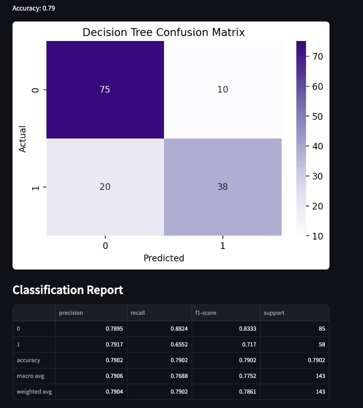

# Welcome to my first Machine Learning Streamlit App!

## Overview

This is an app that allows a user to explore two types of machine learning classifiers: Decision Trees and K Nearest Neighbors (KNN). In the app, the user is allowed to upload their own dataset or use a sample Titanic dataset. Then, they get to choose their model, how they want to split their data, and their random state if they want to replicate results. Depending on their model, they can finetune the hyperparameters to see what works best for them. My goal is for both others and myself to be able to use basic models on datasets of our choosing. 

## Instructions

To run locally:   
  1. Download the MLStreamlitApp folder
  2. Open app.py in your IDE of choice 
  3. Instead of running as a Python script, run 'streamlit run MLStreamlitApp/app.py' in your terminal.

Or, click [this link](https://tsypin-ml.streamlit.app/)

Requirements:
- matplotlib==3.10.1
- numpy==2.2.4
- pandas==2.2.3
- scikit_learn==1.6.1
- seaborn==0.13.2
- streamlit==1.44.1

## App Features

This app features a sidebar menu that allows the user to upload a dataset, choose variables of interest, select and finetune a model, and then display a confusion matrix and classification report.

For both models, the user can pick a random state from 1-100 and a training split size from 0.10 to 0.30. This allows for personalization of the model, and the ability to replicate results. 

### Decision Trees

For the decision tree model, the hyperparameters that can be changed are the max depth, minimum number of samples allowed for a split to happen, and the minimum number of samples allowed in a leaf node. These parameters try to avoid overfitting on the training data, and are relatively simple to understand. The values for these are continuous, so they are selected from a slider by the user. By changing these values, the user can see what works best for their model.

### KNN 

For the KNN model, users can select the number of neighbors they desire, and if to scale their data. The number of neighbors is coded to only be odd so that ties are easily broken. Also, there is a button to select whether to scale your data. I chose to not auto-scale data so that users could see how models performed with and without scaled data. I included a note that scaling is recommended for accurate data analysis. 

## Potential Future Steps

If I were to expand this app, I would include methods on how to determine the best way to fine-tune your parameters. I would also try to find a way to visualize the model but would have to be careful based on how many features it is being trained with. 

