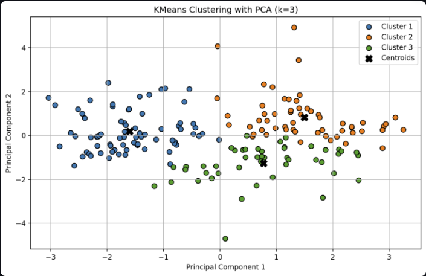

# Welcome to my Unsupervised Learning Streamlit App!

## Overview 

This app allows users to explore relationships in a dataset of their choice through K-Means Clustering and Principal Component Analysis (PCA). The user can either upload a dataset or use the provided wine data, select the features they would like to analyze, select a random state, and choose their desired number of clusters (k). After training the model, a PCA plot is created of the clusters, and performance metrics or run to help a user determine the ideal number of clusters. My goal is for this to be an easy-to-use tool for simple unsupervised learning. 

## Instructions

To run locally: 
  1. Download the MLUnsupervisedApp folder
  2. Open app.py in your IDE of choice 
  3. Instead of running as a Python script, run 'streamlit run MLUnsupervisedApp/app.py' in your terminal.

     or, click [this link](https://tsypin-umlapp.streamlit.app/)

Requirements: 

- matplotlib==3.10.3
- numpy==2.2.5
- pandas==2.2.3
- scikit_learn==1.6.1
- seaborn==0.13.2
- streamlit==1.44.1

## App Features

The app features a sidebar menu that allows the user to upload a dataset and fine-tune features and parameters.   
Upon training a model, the app creates a PCA plot to visualize the clusters ascertained by the model and provides a silhouette score.   
Then, an elbow plot and a silhouette score plot are created by iterating through ks from 2-10 to help a user determine what k is best for analysis. 

## Potential Next Steps

In a potential update to this app, I could provide a way for users to have a target variable for classification and show how the K-means clustering model performs in relation to the actual dataset. 
