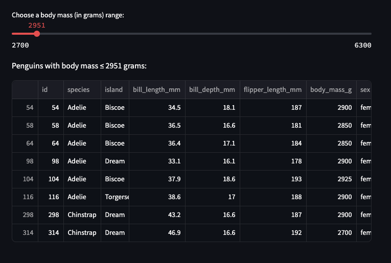

# Welcome to my first basic Streamlit app!

## Overview

This app is a super simple way to explore the Palmer's Penguins dataset by sorting by species or narrowing by body mass. It was an opportunity for me to first work with the Streamlit platform and start to develop interactive data visualizations. 

## Instructions 

To run the app locally, download the basic_streamlit_app folder and run "streamlit run basic_streamlit_app/main.py" in the IDE of your choice. 

## App Features

The app is super simple and first displays the entire Palmer's Penguins dataset. Then, it has sections where you can look at the data for a certain species at a time, or select an upper limit for the weight range of the shown penguins. 

